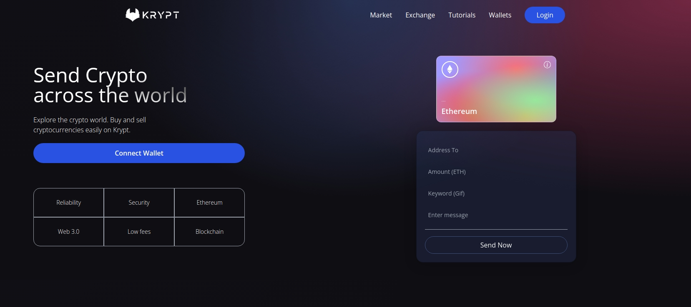
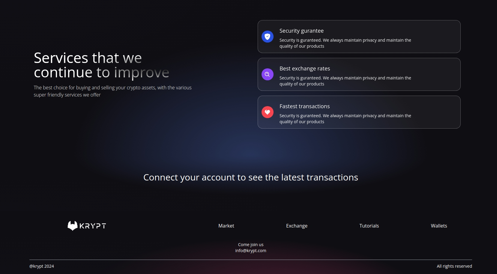

# Krypt web 3.0

## Overview
Web 3.0 represents the next evolution of the internet, characterized by decentralized applications (dApps) that empower users to interact directly with the blockchain, cutting out intermediaries and providing secure, transparent transactions. Built on blockchain technology, Web 3.0 leverages smart contracts, which are self-executing contracts with terms directly written into code. Using Solidity, developers can create these smart contracts on the Ethereum blockchain, enabling programmable, trustless agreements that operate autonomously.




## 1. Tech Stack

- Framework: `React.js`
- Styling: `Tailwind CSS`
- Smart Contract: `Solidity, Metamask, ethers.js`


## Getting Started

To get a local copy of the project up and running, follow these steps:

```bash
git clone https://github.com/mohamedelmougy/krypt-web3.0.git
npm i
npm run dev
```